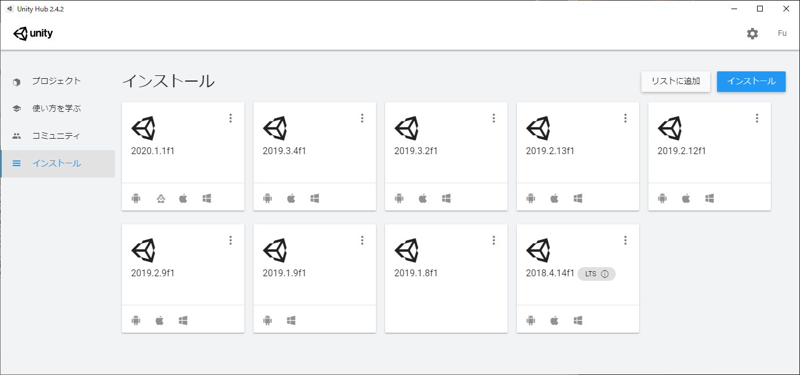
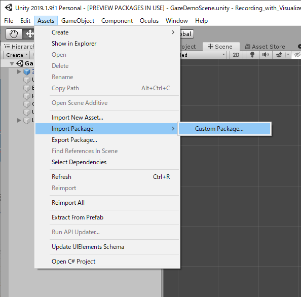
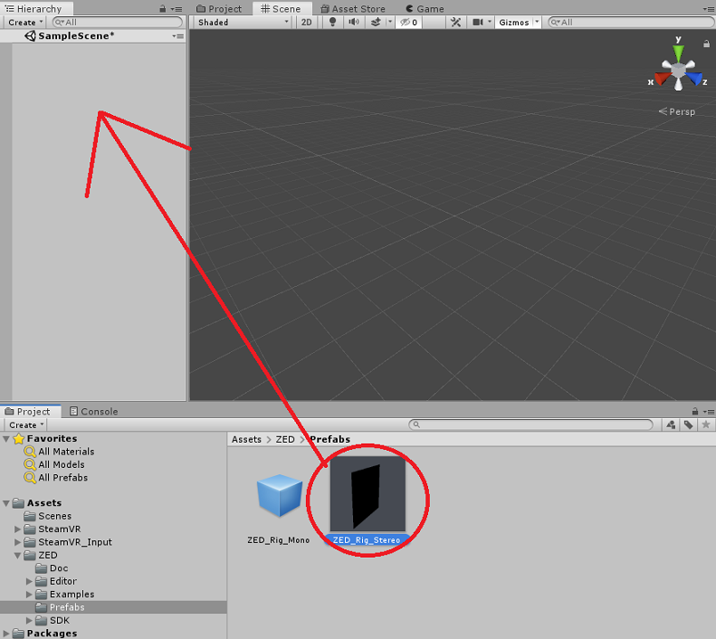
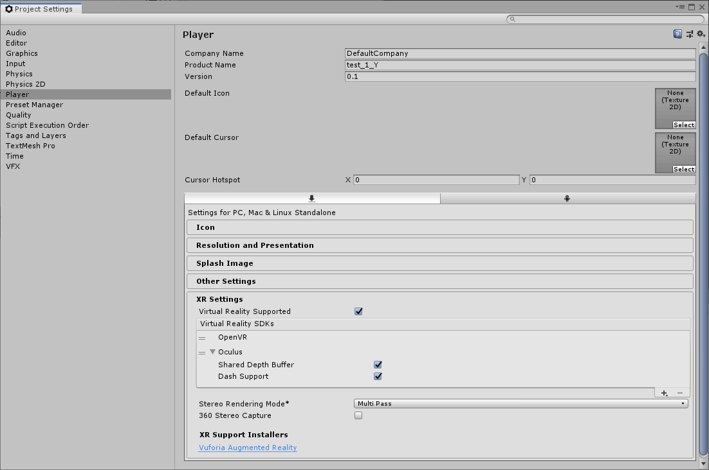

# 目次
- [VIVEとSteamVRのSetup](#VIVEとSteamVRのSetup)
- [Unityのダウンロード・インストール](#Unityのダウンロード・インストール) 
- [プロジェクトの作成](#プロジェクトの作成)
- [SteamVRのPluginを導入](#SteamVRのPluginを導入)
- [ZEDminiのPluginを導入](ZEDminiのPluginを導入)
	- [UnityPackage(Plugin)のインストール](#UnityPackage(Plugin)のインストール)
- [ZEDminiの映像をVIVEにパススルーする方法](#ZEDminiの映像をVIVEにパススルーする方法)
 
 
 

## VIVEとSteamVRのSetup
＝＝＝＝＝＝＝＝＝＝＝＝＝＝＝＝＝＝＝＝＝＝＝＝＝＝＝＝＝＝＝＝＝ 
参考になりそうな(というか参考にした)ページのURLを載せておきます． 
[①](https://www.moguravr.com/htcvive-setup/)　僕が参考にしたページ 
[②](http://www.monobitengine.com/vc/WebDoc/contents/VRSettings/Install_ViveSetup.htm)　改めて調べていたら見つけたもう少しわかりやすそうなページ 
＝＝＝＝＝＝＝＝＝＝＝＝＝＝＝＝＝＝＝＝＝＝＝＝＝＝＝＝＝＝＝＝＝ 
 
以下では僕が参考にしたページ[①](https://www.moguravr.com/htcvive-setup/)を見ながら行った作業を書いていきます． 
[②](http://www.monobitengine.com/vc/WebDoc/contents/VRSettings/Install_ViveSetup.htm)のほうがわかりやすいと思ったら、そちらを見ていただければと思います． 
 
以下手順です． 
 
まずはSteamを下記のURLからインストール  https://store.steampowered.com/?l=japanese 
Steamを利用する際にはアカウントの作成を求められるので、適当なアカウントを作成． 
Steamを起動出来たらVIVEをPCに接続． 
VIVEが認識されたらSteamからSteamVRがダウンロード・起動が可能となります． 
Stemaの右上にVRという文字が出ているはずなので，そこをクリック． 
 
SteamVRが起動出来たらまずはベースステーションとコントローラが接続されるかを確認． 
 
コントローラはSteamVRのメニューから
「デバイス」→「コントローラのペアリング」を行えば接続可能． 
（適宜，フレームウェアのアップデートを求められることがあるので，その場合は有線でPCに繋いでアップデートを行ってください） 
 
ベースステーションは電源を入れたら後ろにあるスイッチでチャンネルを 
片方をb、もう片方をcに変更します． 
 
ベースステーションとコントローラが接続出来たら 
SteamVRのメニューから「ルームセットアップを実行」を選択． 
画面の指示に従い、セットアップを行ってください． 
＝＝＝＝＝＝＝＝＝＝＝＝＝＝＝＝＝＝＝＝＝＝＝＝＝＝＝＝＝＝＝＝＝ 
 
 
 
## Unityのダウンロード・インストール
＝＝＝＝＝＝＝＝＝＝＝＝＝＝＝＝＝＝＝＝＝＝＝＝＝＝＝＝＝＝＝＝＝ 
公式サイトに手順が載っていますので，そちらを見ながらでも出来ます． 
[Windows用](https://create.unity3d.com/jp-howoto-update-win?elqTrackId=f72976ab929342d1800ebde5ca95adbe&elq=00000000000000000000000000000000&elqaid=2114&elqat=2&elqCampaignId=)    
[Mac用](https://create.unity3d.com/jp-howto-update-mac?elqTrackId=22b8cbbf86414008855f29b4c80c0f2b&elq=00000000000000000000000000000000&elqaid=2114&elqat=2&elqCampaignId=) 
なお，私が現在利用しているのはUnityのバージョンは2019.1.9f1です． 
そして，このレポジトリに用意しているスクリプトは，Unity2019.1.9f1で作成・変更したものなので，
それ以降のバージョンを使用する場合は，不具合が起こる可能性がありますので，ご注意ください． 
また，後述するプラグインも，使用するUnityのバージョンによっては
対応していない可能性があります． 
プラグイン側の更新ログなどを確認してください． 
＝＝＝＝＝＝＝＝＝＝＝＝＝＝＝＝＝＝＝＝＝＝＝＝＝＝＝＝＝＝＝＝＝ 

公式サイトにも載っていますが，一応，こちらにも手順を書いておきます． 
 
まずは公式のページからUnityHubをダウンロード 
https://unity3d.com/jp/get-unity/update/  
 
UnityHubをダウンロードして起動してください． 
左側に「プロジェクト」「使い方を学ぶ」「インストール」という項目があるので，
「インストール」の項目を選びます． 
 
 
すると右上にも「インストール」と書かれており，そこをクリックするとUnity本体の正式リリース版の一覧が表示されます． 
その中からインストールしたいバージョンを選んでインストールしてください． 
 
また，Unity使う際，アカウントを作ることになります． 
このアカウントはAssetStoreを使う際に必要です． 
画面の指示に従って作成してください． 
＝＝＝＝＝＝＝＝＝＝＝＝＝＝＝＝＝＝＝＝＝＝＝＝＝＝＝＝＝＝＝＝＝ 
 
 
 
## プロジェクトの作成
＝＝＝＝＝＝＝＝＝＝＝＝＝＝＝＝＝＝＝＝＝＝＝＝＝＝＝＝＝＝＝＝＝ 

UnityHubを起動し，プロジェクトの欄を選びます． 
はじめは何もないと思いますので，右上の新規作成をクリック． 
いくつかテンプレートが存在していますが，3Dを選び，
プロジェクトの保存先を決めて作成します． 
以降は基本的には作成したプロジェクト上での操作になります． 
＝＝＝＝＝＝＝＝＝＝＝＝＝＝＝＝＝＝＝＝＝＝＝＝＝＝＝＝＝＝＝＝＝ 
 
 
 
## SteamVRのPluginを導入
＝＝＝＝＝＝＝＝＝＝＝＝＝＝＝＝＝＝＝＝＝＝＝＝＝＝＝＝＝＝＝＝＝ 
まずは参考にしたサイトのURLを載せておきます． 
http://www.monobitengine.com/vc/WebDoc/contents/Project_VRCloud/Install_SteamVR_Plugin.htm 
＝＝＝＝＝＝＝＝＝＝＝＝＝＝＝＝＝＝＝＝＝＝＝＝＝＝＝＝＝＝＝＝＝ 

Unity内のAssetStoreタブを押します． 
そこでSteamVR Pluginを検索し，ダウンロード・インポートします． 
もしUnityのアカウントをまだ作ってないならこの時に画面の表示に従って作ってください． 
 
なお，ブラウザからも見ることができます．その場合，ダウンロードを押すと，Unityに切り替わってダウンロードします． 
NiCTのLANからだと上手くいかないこともあるため，気をつけてください． 
私はMacのネットワーク共有でguestWifiを使ってダウンロードしました． 
 
さて，「ダウンロード」を押してしばらくすると 
「Import Unity Package」というウィンドウが出るので、右下の「Import」を押します． 
そのあとに「SteamVR_Settings」というウィンドウも出るので、「Accept All」をクリックしてください． 
 
 
もし，ダウンロードなどが上手くいかない場合は，[こちら]()にSteamVRのPacageを置いています． 
（ファイル名はsteamvr_2_3_2.unitypackage） 
それを次節の[プラグインの導入](#UnityPackage(Plugin)のインストール)と同じようにImportしていただければ大丈夫です． 
＝＝＝＝＝＝＝＝＝＝＝＝＝＝＝＝＝＝＝＝＝＝＝＝＝＝＝＝＝＝＝＝＝ 
 
 
 
## ZEDminiのPluginを導入
＝＝＝＝＝＝＝＝＝＝＝＝＝＝＝＝＝＝＝＝＝＝＝＝＝＝＝＝＝＝＝＝＝ 
まずは参考にしたサイト，というか公式サイトのURLを載せておきます． 
https://www.stereolabs.com/docs/unity/  
＝＝＝＝＝＝＝＝＝＝＝＝＝＝＝＝＝＝＝＝＝＝＝＝＝＝＝＝＝＝＝＝＝ 

まず、ZED SDKをSTEREO LABSの公式サイトからダウンロードします． 
https://www.stereolabs.com/developers/release/
 
次に
Unity用のZEDminiのプラグインを以下のURLからダウンロードします． 
https://github.com/stereolabs/zed-unity/releases  
なお，私が現在利用しているプラグインのバージョンは2.8.1です． 
（ファイル名はZED_Unity_Plugin_v2.8.1.unitypackage） 
それ以外のバージョンを使う際はUnityのバージョンや仕様の変更などを確認したうえでご利用ください． 
次にダウンロードしたプラグインをUnityにインストールします． 
 
### UnityPackage(Plugin)のインストール
Unityのメニューから
「Assets」->「Import package」->「Custom Package」
とし、ダウンロードした「ZED_Unity_Plugin_v2.8.1.unitypackage」を選択． 
 
「Import Unity Package」というウィンドウが出るので、右下の「Import」を押す． 
＝＝＝＝＝＝＝＝＝＝＝＝＝＝＝＝＝＝＝＝＝＝＝＝＝＝＝＝＝＝＝＝＝ 
 
 
 
## ZEDminiの映像をVIVEにパススルーする方法
＝＝＝＝＝＝＝＝＝＝＝＝＝＝＝＝＝＝＝＝＝＝＝＝＝＝＝＝＝＝＝＝＝ 

Unityの左側にある「Hierarchy」内の「MainCamera」と「Directional Light」を削除。 
 
次にUnityの下側に表示されているであろう「Project」タブを見る． 
その中の「Assets」->「ZED」->「Prefabs」を見て、その中の「ZED_Rig_Stereo」を「Hierarchy」にドラッグして追加．
  
次に
Unityのメニューの「Edit」->「ProjectSetting」を押してウィンドウを出す． 
その中の「Player」->「XR Settings」を見る． 
そこの「Virtual Reality Supported」の項目にチェックが入っているか確認．（チェックがないならチェックする） 
OpenVRが入ってないとその項目が出ないです． 
（OpenVRはSteamVRのプラグインを入れるときに一緒に入っているはず．） 
もしその項目がないならインストールが上手くいってないということなので，
その場合はやり直してください． 

 
 
あとはベースステーションの電源を入れ，
ZEDminiをPCに繋いで実行する（Unityの真ん中，うえの方にある再生ボタンを押す）ことでパススルーができます． 
 

