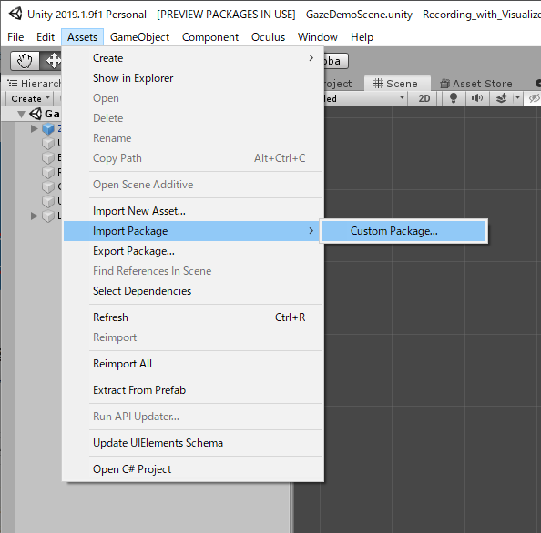

# 目次
- [ソフトウェアのダウンロード・インストール](#ソフトウェアのダウンロード・インストール)
- [PupilLabsのUnityPackageを導入](#PupilLabsのUnityPackageを導入) 
- [PupilLabsを使うために](#PupilLabsを使うために)
<br />
<br />
<br />

## ソフトウェアのダウンロード・インストール
＝＝＝＝＝＝＝＝＝＝＝＝＝＝＝＝＝＝＝＝＝＝＝＝＝＝＝＝＝＝＝＝＝<br>
公式の用意したGitHubにも手順が載っています．→[ここ](https://github.com/pupil-labs/hmd-eyes)<br>
一応，こちらにもまとめておきます．<br>
＝＝＝＝＝＝＝＝＝＝＝＝＝＝＝＝＝＝＝＝＝＝＝＝＝＝＝＝＝＝＝＝＝<br>
まずは必要なソフトウェアをダウンロードします．<br>
[こちら](https://github.com/pupil-labs/pupil/releases)
から最新のものをダウンロードしてください．<br>
その中に入ってるPupil CaptureをProject実行時に使います．<br>
<br>
次にPupilLabsのUnityPackageをダウンロードします．<br>
[こちら](https://github.com/pupil-labs/hmd-eyes/releases)
からダウンロードしてください．<br>
なお，私が現在利用しているのはHmd-Eyes.VR.v1.1です．<br>
そして，このレポジトリに用意しているスクリプトは，Unity2019.1.9f1，Hmd-Eyes.VR.v1.1で作成・変更したものなので，<br>
それ以降のバージョンを使用する場合は，不具合が起こる可能性がありますので，ご注意ください．<br>
＝＝＝＝＝＝＝＝＝＝＝＝＝＝＝＝＝＝＝＝＝＝＝＝＝＝＝＝＝＝＝＝＝<br>
<br>
<br>
<br>
## PupilLabsのUnityPackageを導入
＝＝＝＝＝＝＝＝＝＝＝＝＝＝＝＝＝＝＝＝＝＝＝＝＝＝＝＝＝＝＝＝＝<br>
PupilLabsのPackageをインポートしたいプロジェクトを開きます．<br>
Unityのメニューから<br>
「Assets」->「Import package」->「Custom Package」<br>
とし、ダウンロードした「Hmd-Eyes.VR.v1.1.unitypackage」を選択．<br>
<br>
「Import Unity Package」というウィンドウが出るので、右下の「Import」を押します．<br>
＝＝＝＝＝＝＝＝＝＝＝＝＝＝＝＝＝＝＝＝＝＝＝＝＝＝＝＝＝＝＝＝＝<br>
<br>
<br>
<br>
## PupilLabsを使うために
＝＝＝＝＝＝＝＝＝＝＝＝＝＝＝＝＝＝＝＝＝＝＝＝＝＝＝＝＝＝＝＝＝<br>
Unity上でPupilLabsを使うために<br>
次にUnityの下側に表示されているであろう「Project」タブを見る．<br>
その中の「Assets」->「Plugins」->「Pupil」->「Prefabs」を見て、<br>
その中の「Gaze Tracker」を「Hierarchy」にドラッグして追加．<br>
 <br>


これだけでは正常に動作しないためInspectorでの設定と<br>
ProjectSettingを弄る必要があります．<br>

## Inspectorでの設定
Inspectorで必要な設定を以下にまとめます．
```
・ZED_Rig_Stereo下の
	・Camera_eyesの下の
		・Left_eye：TagをMainCameraに設定
・GazeTracker下の
	・Connection：IPアドレスがローカル(127.0.0.1)で，PORT番号が50020になっていることを確認
	・Eye Frame Visualizer：Camera as parent を Left_eye に設定
  ・Gaze Visualizer：Gaze Origin を Left_eye に設定
  ・Calibration Controller：Camera を Left_eye に設定
```

## ProjectSettingでの設定
 Unityのメニューの「Edit」->「ProjectSetting」を押して
 ProjectSettingのウインドウを出してください．<br>
 「Player」->「Other Settings」->「Configuration」<br>
 といくと「ApiCompatibilityLevl」という項目があります．<br>
 デフォルトでは「.Net Standard 2.0」となっているので<br>
 これを「.Net 4.x」に変更してください．<br>
＝＝＝＝＝＝＝＝＝＝＝＝＝＝＝＝＝＝＝＝＝＝＝＝＝＝＝＝＝＝＝＝＝<br>
<br>
<br>
<br>
