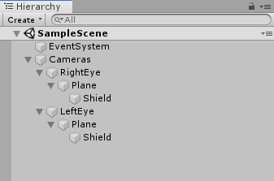

# 目次
- [MP4Playerについて](#MP4Playerについて)
- [MP4Player のオブジェクト](#MP4Playerについて-のオブジェクト)    
	- [追加したゲームオブジェクトとその追加方法 および 追加した目的](#追加したゲームオブジェクトとその追加方法-および-追加した目的)   
	- [追加したC#のスクリプト および 追加した目的](#追加したCのスクリプト-および-追加した目的)  
	- [オブジェクトに追加したスクリプトなど](#オブジェクトに追加したスクリプトなど)  
	- [Inspectorでの設定](#Inspectorでの設定)  
	- [ゲームオブジェクトの座標](#ゲームオブジェクトの座標)  

 
 
 

## MP4Playerについて
＝＝＝＝＝＝＝＝＝＝＝＝＝＝＝＝＝＝＝＝＝＝＝＝＝＝＝＝＝＝＝＝＝ 
VRヘッドセット(VIVE or Oculus) を使用． 
録画した動画をMP4に変換後，HMDで見るためのプロジェクト． 
 
(必要があれば適宜追記) 
＝＝＝＝＝＝＝＝＝＝＝＝＝＝＝＝＝＝＝＝＝＝＝＝＝＝＝＝＝＝＝＝＝ 
 

### 必要な準備

＝＝＝＝＝＝＝＝＝＝＝＝＝＝＝＝＝＝＝＝＝＝＝＝＝＝＝＝＝＝＝＝＝ 
環境構築が必要です． 
[こちら](https://github.com/atsushi-wada/fpp-recording/tree/master/example/1.environment)を参考に，SteamVRのPluginを導入まで進めてください． 
＝＝＝＝＝＝＝＝＝＝＝＝＝＝＝＝＝＝＝＝＝＝＝＝＝＝＝＝＝＝＝＝＝ 
 
 
 
## MP4Player のオブジェクト
＝＝＝＝＝＝＝＝＝＝＝＝＝＝＝＝＝＝＝＝＝＝＝＝＝＝＝＝＝＝＝＝＝ 
まずゲームオブジェクトは何があるのかを紹介します． 
以下の画像に載っている通りです． 
  
すべて追加したオブジェクトです． 
＝＝＝＝＝＝＝＝＝＝＝＝＝＝＝＝＝＝＝＝＝＝＝＝＝＝＝＝＝＝＝＝＝ 
 
 
### 追加したゲームオブジェクトとその追加方法 および 追加した目的
＝＝＝＝＝＝＝＝＝＝＝＝＝＝＝＝＝＝＝＝＝＝＝＝＝＝＝＝＝＝＝＝＝  
オブジェクトはヒエラルキー部分の右クリックで追加可能です．  
またオブジェクトの親子関係は分かるように書いたつもりですが， 
分かりにくかったら上で表示してる画像で確認してください． 
＝＝＝＝＝＝＝＝＝＝＝＝＝＝＝＝＝＝＝＝＝＝＝＝＝＝＝＝＝＝＝＝＝ 

	・Cameras：CreatEmptyで追加__両目の位置調整をまとめて行うため  
		・RightEye：Cameraで追加__右目側で見る映像のため
			・Plane         ：3D ObjectのPlaneで追加__映像を表示するため
			  ・Shield：3D ObjectのPlaneで追加__余分な場所を写さないため 
		・LeftEye：Cameraで追加__左目側で見る映像のため
			・Plane         ：3D ObjectのPlaneで追加__映像を表示するため
			  ・Shield：3D ObjectのPlaneで追加__余分な場所を写さないため 
＝＝＝＝＝＝＝＝＝＝＝＝＝＝＝＝＝＝＝＝＝＝＝＝＝＝＝＝＝＝＝＝＝ 
 
 
### 追加したC#のスクリプト および 追加した目的
＝＝＝＝＝＝＝＝＝＝＝＝＝＝＝＝＝＝＝＝＝＝＝＝＝＝＝＝＝＝＝＝＝ 
 
	・LayerSelectorRight.cs： 右目用の映像のみを写すため
	・LayerSelectorLeft.cs	： 左目用の映像のみを写すため
＝＝＝＝＝＝＝＝＝＝＝＝＝＝＝＝＝＝＝＝＝＝＝＝＝＝＝＝＝＝＝＝＝ 
これらのスクリプトは[ここ](https://github.com/atsushi-wada/fpp-recording/tree/master/project/MP4Player/%E8%BF%BD%E5%8A%A0%E3%81%97%E3%81%9F%E3%82%B9%E3%82%AF%E3%83%AA%E3%83%97%E3%83%88)に用意しています．
 
＝＝＝＝＝＝＝＝＝＝＝＝＝＝＝＝＝＝＝＝＝＝＝＝＝＝＝＝＝＝＝＝＝ 
 
 
### オブジェクトに追加したスクリプトなど
＝＝＝＝＝＝＝＝＝＝＝＝＝＝＝＝＝＝＝＝＝＝＝＝＝＝＝＝＝＝＝＝＝ 
ゲームオブジェクトを追加しただけでは何も動作しません． 
C#のスクリプトにて，させたい動作を書く必要があります． 
また，書いたスクリプトをゲームオブジェクトに追加する必要があります． 
追加方法は 
・オブジェクトを選択し，右側に表示されるInspectorのAddComponentで検索して追加  
・Unityの下のProjectタブから追加したいスクリプトをドラッグして，追加したいオブジェクトのところにドロップ  
のどちらかです． 
置いてる場所が分からなかい場合は前者でいいと思います． 
＝＝＝＝＝＝＝＝＝＝＝＝＝＝＝＝＝＝＝＝＝＝＝＝＝＝＝＝＝＝＝＝＝ 
	
	・RightEye	：LayerSelectorRight.csを追加
		・Plane	：VideoPlayerを追加
			・Shield：BLACK.matを追加
	・LeftEye	：LayerSelectorLeft.csを追加
		・Plane	：VideoPlayerを追加
			・Shield：BLACK.matを追加
＝＝＝＝＝＝＝＝＝＝＝＝＝＝＝＝＝＝＝＝＝＝＝＝＝＝＝＝＝＝＝＝＝ 
 
 
### Inspectorでの設定
＝＝＝＝＝＝＝＝＝＝＝＝＝＝＝＝＝＝＝＝＝＝＝＝＝＝＝＝＝＝＝＝＝ 
ゲームオブジェクトにスクリプトを追加するだけではうまく動作しないものもあります．   
Inspectorで設定する前提で書いたスクリプトなどがあるとそうなります． 
このプロジェクトでInspectorで設定するものを書いておきます． 
（オブジェクトの指定などはドラッグ&ドロップするか，リストから指定する） 
＝＝＝＝＝＝＝＝＝＝＝＝＝＝＝＝＝＝＝＝＝＝＝＝＝＝＝＝＝＝＝＝＝ 

	・RightEye：Layerを適当なLayerを作成して設定（LayerはLayerSelectorRight.csなどで参照するのに使用．用意したスクリプトではRightEyeとしている）
		ClearFlagsをSolidColorに設定
		Backgroundを真っ黒に設定
		Field of Viewを66.2に設定
		TargetEyeをRightに設定
		・Plane：Rotationが(x,y,z)=(90,270,90)　
			   Scaleが(x,y,z)=(3.2, 1, 0.9)　
			   MeshRenderの
			   	LightProbsをOff
				ReflectionProbesをOff
				CastShadowsをOff
				RecieveShadowsのチェックをはずす
			   VideoPlayerのSourceで再生したいMP4ファイルを選択
	    		・Shield：Rotationが(x,y,z)=(180,180,270)　
	・LeftEye：Layerを適当なLayerを作成して設定（LayerはLayerSelectorLeft.csなどで参照するのに使用．用意したスクリプトではLeftEyeとしている）
		ClearFlagsをSolidColorに設定
		Backgroundを真っ黒に設定
		Field of Viewを66.2に設定
		TargetEyeをLeftに設定
		・Plane：Rotationが(x,y,z)=(90,270,90)　
			   Scaleが(x,y,z)=(3.2, 1, 0.9)　
			   MeshRenderの
			   	LightProbsをOff
				ReflectionProbesをOff
				CastShadowsをOff
				RecieveShadowsのチェックをはずす　
			   VideoPlayerのSourceで再生したいMP4ファイルを選択
	    		・Shield：Rotationが(x,y,z)=(0,0,270)　
                   
    いづれも子オブジェクト(PlaneとShield)が親オブジェクトと同じLayerになっていることを確認	
＝＝＝＝＝＝＝＝＝＝＝＝＝＝＝＝＝＝＝＝＝＝＝＝＝＝＝＝＝＝＝＝＝ 		

＝＝＝＝＝＝＝＝＝＝＝＝＝＝＝＝＝＝＝＝＝＝＝＝＝＝＝＝＝＝＝＝＝ 
 
 
### ゲームオブジェクトの座標
＝＝＝＝＝＝＝＝＝＝＝＝＝＝＝＝＝＝＝＝＝＝＝＝＝＝＝＝＝＝＝＝＝ 
オブジェクトの座標は基本的にUnity上での絶対座標を使い，そのオブジェクトの中心の座標で表されます． 
また，子オブジェクトの座標は，UnityのInspector上では，親オブジェクトの座標を基準とした相対座標となっています． 
 
位置調整は面倒だと思うので，私が調整した後の座標を記載しています． 
（座標はUnityのInspector上で表示されるものを書いています）
 
＝＝＝＝＝＝＝＝＝＝＝＝＝＝＝＝＝＝＝＝＝＝＝＝＝＝＝＝＝＝＝＝＝ 

	・Cameras：(x,y,z)=(0,0,0)
		・RightEye：(x,y,z)=(0,0,0)
			・Plane：(x,y,z)=(-8, 0, 8.547)
				・Shield：(x,y,z)=(0,1,0)
		・LeftEye：(x,y,z)=(0,0,0)
			・Plane：(x,y,z)=(8, 0, 8.547)
				・Shield：(x,y,z)=(0,1,0)
 
＝＝＝＝＝＝＝＝＝＝＝＝＝＝＝＝＝＝＝＝＝＝＝＝＝＝＝＝＝＝＝＝＝ 

 
 
 
