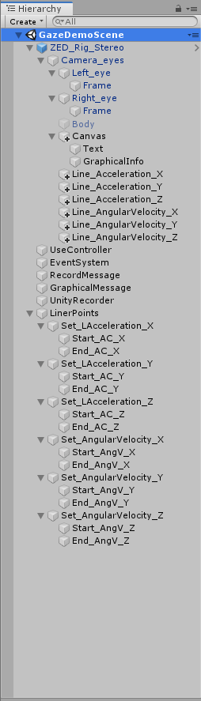

# 目次
- [Oculus with BackPackPCについて](#Oculus-with-BackPackPCについて)
- [Oculus with BackPackPCのオブジェクト](#Oculus-with-BackPackPC-のオブジェクト)    
	- [追加したゲームオブジェクトとその追加方法 および 追加した目的](#追加したゲームオブジェクトとその追加方法-および-追加した目的)  
	- [変更したC#のスクリプト](#変更したCのスクリプト)  
	- [追加したC#のスクリプト および 追加した目的](#追加したCのスクリプト-および-追加した目的)  
	- [オブジェクトに追加したスクリプト](#オブジェクトに追加したスクリプト)  
	- [Inspectorでの設定](#Inspectorでの設定)  
	- [ゲームオブジェクトの座標](#ゲームオブジェクトの座標およびスケールなど)  
		- [画面に文字を表示するためのオブジェクト](#画面に文字を表示するためのオブジェクト)   
		- [棒グラフの始点終点を決めるオブジェクト](#棒グラフの始点終点を決めるオブジェクト)  
	- [ProjectSettings](#ProjectSettings)
 
 
 

## Oculus with BackPackPCについて
＝＝＝＝＝＝＝＝＝＝＝＝＝＝＝＝＝＝＝＝＝＝＝＝＝＝＝＝＝＝＝＝＝ 
Oculus Rift S と ZEDmini を使用 
 
パススルーしながらZEDmini内臓のIMUセンサから加速度と角速度を抽出し，
画面上にて棒グラフにてリアルタイムで表示するプロジェクトです． 
 
主な仕様は以下の通りです． 
- コントローラのボタンで録画開始と録画停止が可能  
録画に失敗した場合はその旨を画面に表示
- 重力加速度を垂直方向に9.8m/s^2とし，それを取り除いた結果を棒グラフで表示 

＝＝＝＝＝＝＝＝＝＝＝＝＝＝＝＝＝＝＝＝＝＝＝＝＝＝＝＝＝＝＝＝＝ 
 

### 必要な準備

＝＝＝＝＝＝＝＝＝＝＝＝＝＝＝＝＝＝＝＝＝＝＝＝＝＝＝＝＝＝＝＝＝ 
環境構築が必要です． 
[こちら](https://github.com/atsushi-wada/fpp-recording/tree/master/preparation/1.environment)を参考に，パススルーできるところまで進めてください． 
＝＝＝＝＝＝＝＝＝＝＝＝＝＝＝＝＝＝＝＝＝＝＝＝＝＝＝＝＝＝＝＝＝ 
 
 
 
## Oculus with BackPackPC のオブジェクト
＝＝＝＝＝＝＝＝＝＝＝＝＝＝＝＝＝＝＝＝＝＝＝＝＝＝＝＝＝＝＝＝＝ 
まずゲームオブジェクトは何があるのかを紹介します． 
以下の画像に載っている通りです． 
  
すべてが元から用意されたものではないので， 
次にどれが追加したものかを載せておきます． 
＝＝＝＝＝＝＝＝＝＝＝＝＝＝＝＝＝＝＝＝＝＝＝＝＝＝＝＝＝＝＝＝＝ 
 
 
### 追加したゲームオブジェクトとその追加方法 および 追加した目的
＝＝＝＝＝＝＝＝＝＝＝＝＝＝＝＝＝＝＝＝＝＝＝＝＝＝＝＝＝＝＝＝＝  
オブジェクトはヒエラルキー部分の右クリックで追加可能です．  
またオブジェクトの親子関係は分かるように書いたつもりですが， 
分かりにくかったら上で表示してる画像で確認してください． 
＝＝＝＝＝＝＝＝＝＝＝＝＝＝＝＝＝＝＝＝＝＝＝＝＝＝＝＝＝＝＝＝＝ 

	・ZED_Rig_StereoのCamera_eyesの下の  
		・Canvasの下の
			・Text         ：UIのTextで追加__録画の開始と停止、失敗を画面に表示するため
			・GraphicalInfo：UIのTextで追加__棒グラフのラベルの表示のため  
		・Line_Accelaration_X	：CreatEmptyで追加__棒グラフの挙動を決定するため
		・Line_Accelaration_Y	：CreatEmptyで追加__棒グラフの挙動を決定するため
		・Line_Accelaration_Z	：CreatEmptyで追加__棒グラフの挙動を決定するため
		・Line_AngularVelocity_X ：CreatEmptyで追加__棒グラフの挙動を決定するため
		・Line_AngularVelocity_Y ：CreatEmptyで追加__棒グラフの挙動を決定するため
		・Line_AngularVelocity_Z ：CreatEmptyで追加__棒グラフの挙動を決定するため
	・UseController		：CreatEmptyで追加__csvファイルへの出力に関するスクリプトを使うため  
	・RecordMessage		：CreatEmptyで追加__録画の開始と停止、失敗を画面に表示するため  
	・GraphicalMessage	：CreatEmptyで追加__棒グラフのラベルの表示のため   
	・LinePoints		：CreatEmptyで追加__棒グラフの始点・終点を決定するため
		・Set_○○	：CreatEmptyで追加__どれがどの棒グラフの始点・終点かを分かりやすくするため
			・Start_○○	：CreatEmptyで追加__棒グラフの視点
			・End_○○	：CreatEmptyで追加__棒グラフの終点
＝＝＝＝＝＝＝＝＝＝＝＝＝＝＝＝＝＝＝＝＝＝＝＝＝＝＝＝＝＝＝＝＝ 
 
 
### 変更したC#のスクリプト
＝＝＝＝＝＝＝＝＝＝＝＝＝＝＝＝＝＝＝＝＝＝＝＝＝＝＝＝＝＝＝＝＝ 

	・ZEDManager.cs
	・ZEDCameraEditor.cs
＝＝＝＝＝＝＝＝＝＝＝＝＝＝＝＝＝＝＝＝＝＝＝＝＝＝＝＝＝＝＝＝＝ 
これらはのスクリプトは[ここ](https://github.com/atsushi-wada/fpp-recording/tree/master/project/Oculus%20with%20BackPackPC/%E5%A4%89%E6%9B%B4%E3%81%97%E3%81%9F%E3%82%B9%E3%82%AF%E3%83%AA%E3%83%97%E3%83%88)に用意しています． 
変更箇所も軽くまとめておきます．
#### ZEDManager.cs

変更箇所

<pre>
<code>
389行目～408行目で各種宣言．
        主にcsvに出力する時に使うものです．
private void AcquireImages() の中
        1708行目～1718行目に追記．
        csvに書き出すデータを、リストに追加する部分です．
void Update()　の中
        1977行目～2043行目に追記．
        センサデータから絶対座標などを算出する部分です．
        センサデータを棒グラフにしてHMDの画面上に表示したり、絶対座標を計算してcsvに出力するために使用しています．
</code>
</pre>

#### ZEDCameraEditor.cs

変更箇所

<pre>
<code>
606行目～651行目に追記．
	録画開始と録画停止に関する箇所です．
        録画開始時に日付の取得と出力先の設定を行います．
        録画停止時にはリストをcsvに出力し、リストを初期化します．
</code>
</pre>

＝＝＝＝＝＝＝＝＝＝＝＝＝＝＝＝＝＝＝＝＝＝＝＝＝＝＝＝＝＝＝＝＝ 
 
 

### 追加したC#のスクリプト および 追加した目的
＝＝＝＝＝＝＝＝＝＝＝＝＝＝＝＝＝＝＝＝＝＝＝＝＝＝＝＝＝＝＝＝＝ 
 
	・Acceleration_X.cs	： 棒グラフの動きを決めるため
	・Acceleration_Y.cs	： 棒グラフの動きを決めるため
	・Acceleration_Z.cs	： 棒グラフの動きを決めるため
	・AngularVelocity_X.cs	： 棒グラフの動きを決めるため
	・AngularVelocity_Y.cs	： 棒グラフの動きを決めるため
	・AngularVelocity_Z.cs	： 棒グラフの動きを決めるため
	・UseController.cs	： HMD付属のコントローラのボタンで録画開始と録画停止を行うため
	・RecordMessage.cs	： 録画開始，録画停止，録画失敗を画面に表示するため
	・GraphicalMessage.cs	： 棒グラフのラベルを表示するため（あとはリアルタイムでセンサデータを画面に数値として表示する際も使用）
＝＝＝＝＝＝＝＝＝＝＝＝＝＝＝＝＝＝＝＝＝＝＝＝＝＝＝＝＝＝＝＝＝ 
これらのスクリプトは[ここ](https://github.com/atsushi-wada/fpp-recording/tree/master/project/Oculus%20with%20BackPackPC/%E8%BF%BD%E5%8A%A0%E3%81%97%E3%81%9F%E3%82%B9%E3%82%AF%E3%83%AA%E3%83%97%E3%83%88)に用意しています．
 
＝＝＝＝＝＝＝＝＝＝＝＝＝＝＝＝＝＝＝＝＝＝＝＝＝＝＝＝＝＝＝＝＝ 
 
 
### オブジェクトに追加したスクリプト
＝＝＝＝＝＝＝＝＝＝＝＝＝＝＝＝＝＝＝＝＝＝＝＝＝＝＝＝＝＝＝＝＝ 
ゲームオブジェクトを追加しただけでは何も動作しません． 
C#のスクリプトにて，させたい動作を書く必要があります． 
また，書いたスクリプトをゲームオブジェクトに追加する必要があります． 
追加方法は 
・オブジェクトを選択し，右側に表示されるInspectorのAddComponentで検索して追加  
・Unityの下のProjectタブから追加したいスクリプトをドラッグして，追加したいオブジェクトのところにドロップ  
のどちらかです． 
置いてる場所が分からなかい場合は前者でいいと思います． 
＝＝＝＝＝＝＝＝＝＝＝＝＝＝＝＝＝＝＝＝＝＝＝＝＝＝＝＝＝＝＝＝＝ 
	
	・Line_Accelaration_X	：LineRenderとAcceleration_X.csを追加
	・Line_Accelaration_Y	：LineRenderとAcceleration_Y.csを追加
	・Line_Accelaration_Z	：LineRenderとAcceleration_Z.csを追加
	・Line_AngularVelocity_X ：LineRenderとAngularVelocity_X.csを追加
	・Line_AngularVelocity_Y ：LineRenderとAngularVelocity_Y.csを追加
	・Line_AngularVelocity_Z ：LineRenderとAngularVelocity_Z.csを追加
	・UseController		：UseController.csを追加
	・RecordMessage		：RecordMessage.csを追加
	・GraphicalMessage	：GraphicalMessage.csを追加
＝＝＝＝＝＝＝＝＝＝＝＝＝＝＝＝＝＝＝＝＝＝＝＝＝＝＝＝＝＝＝＝＝ 
 
 
### Inspectorでの設定
＝＝＝＝＝＝＝＝＝＝＝＝＝＝＝＝＝＝＝＝＝＝＝＝＝＝＝＝＝＝＝＝＝ 
ゲームオブジェクトにスクリプトを追加するだけではうまく動作しないものもあります．   
Inspectorで設定する前提で書いたスクリプトなどがあるとそうなります． 
このプロジェクトでInspectorで設定するものを書いておきます． 
（オブジェクトの指定などはドラッグ&ドロップするか，リストから指定する） 
＝＝＝＝＝＝＝＝＝＝＝＝＝＝＝＝＝＝＝＝＝＝＝＝＝＝＝＝＝＝＝＝＝ 

	・ZED_Ri_Stereo：ZEDManeger
		AdvancedSettings の Set IMU Prior in AR は常にチェックをしておくこと．
		でないとセンサデータが時間経過で正しくない動作をする．（誤差が補正されず，移動してないのにセンサの値がドリフトしていく．）
		・Camera_eyes：TagをMainCameraに設定
			・Left_eye：TagをMainCameraに設定
			・Canvas  ：Canvas の RenderMode を WorldSpace に設定
	・Line_○○：Line Render 
		Use World Space のチェックを外しておく
	・Line_Accelaration_○：Acceleration_○ （○にはX,Y,Zが入る）  
		Start Point には オブジェクトの Start_AC_○ を指定  
		End Point   には オブジェクトの End_AC_○ を指定 
		Manager には オブジェクトの ZED_Rig_Stereo を指定 
	・Line_AngularVelocity_○：AngularVelocity_○ （○にはX,Y,Zの対応したものが入る）  
		Start Point には オブジェクトの Start_AngV_○ を指定 
		End Point   には オブジェクトの End_AngV_○ を指定 
		Manager には オブジェクトの ZED_Rig_Stereo を指定 
	・UseController：UseController
		Manager には オブジェクトの ZED_Rig_Stereo を指定 
		Record Mesage には オブジェクトの RecordMessage を指定
	・RecordMessage：RecordMessage
		Text_object には オブジェクトの Text を指定
		Manager には オブジェクトの ZED_Rig_Stereo を指定 
	・GraphicalMessage：GraphicalMessage
		Text_object には オブジェクトの GraphicalInfo を指定
		Manager には オブジェクトの ZED_Rig_Stereo を指定 	
＝＝＝＝＝＝＝＝＝＝＝＝＝＝＝＝＝＝＝＝＝＝＝＝＝＝＝＝＝＝＝＝＝ 		
Acceleration_○.cs や AngularVelocity_○.cs のStart PointとEnd Pointの指定は， 
棒グラフの始点終点を決めるためだけのものなので，座標をスクリプト内で指定するなら不要です． 
（その場合はスクリプト内のStartPointとEndPointも不要） 
＝＝＝＝＝＝＝＝＝＝＝＝＝＝＝＝＝＝＝＝＝＝＝＝＝＝＝＝＝＝＝＝＝ 
 
 
### ゲームオブジェクトの座標およびスケールなど
＝＝＝＝＝＝＝＝＝＝＝＝＝＝＝＝＝＝＝＝＝＝＝＝＝＝＝＝＝＝＝＝＝ 
オブジェクトの座標は基本的にUnity上での絶対座標を使い，そのオブジェクトの中心の座標で表されます． 
また，子オブジェクトの座標は，UnityのInspector上では，親オブジェクトの座標を基準とした相対座標となっています． 
 
本プロジェクトで座標を気にする必要があるのは， 
画面に文字を表示するためのオブジェクトと
棒グラフの始点終点を決めるオブジェクトです． 
また，画面に文字を表示するためのオブジェクトはスケールも気にする必要があります． 
（テキストのフォント設定についてはスクリプトから指定しているので省略します） 
 
位置調整やスケールの調整などは面倒だと思うので，参考程度に私が見やすいと思った座標を記載しています． 
（座標はUnityのInspector上で表示されるものを書いています） 
＝＝＝＝＝＝＝＝＝＝＝＝＝＝＝＝＝＝＝＝＝＝＝＝＝＝＝＝＝＝＝＝＝ 

#### 画面に文字を表示するためのオブジェクト

	・ZED_Rig_Stereo：(x,y,z)=(0,0,0)
		・Camera_eyes：(x,y,z)=(0,0,0)
			・Canvas：(x,y,z)=(0,0,2)，Width=600, Hight=200, Scale(x,y,z)=(0.0025, 0.0025, 1)
				・Text：(x,y,z)=(0,2,-0.8)，Width=600, Hight=200
				・GraphicalInfo：(x,y,z)=(-665.9,-87,-0.24)，Width=600, Hight=200
 
＝＝＝＝＝＝＝＝＝＝＝＝＝＝＝＝＝＝＝＝＝＝＝＝＝＝＝＝＝＝＝＝＝ 

#### 棒グラフの始点終点を決めるオブジェクト

	・LinePoints：(x,y,z)=(0,0,2)
		・Set_LAcceleration_○：(x,y,z)=(0,0,0)
			・Start_AC_X：(x,y,z)=(-1,0,0)
			・End_AC_X  ：(x,y,z)=(-0.9,0,0)
			・Start_AC_Y：(x,y,z)=(-1,-0.1,0)
			・End_AC_Y  ：(x,y,z)=(-0.9,-0.1,0)
			・Start_AC_Z：(x,y,z)=(-1,-0.2,0)
			・End_AC_Z  ：(x,y,z)=(-0.9,-0.2,0)
		・Set_AngularVelocity_○：(x,y,z)=(0,0,0)
			・Start_AngV_X：(x,y,z)=(-1,-0.3,0)
			・End_AngV_X  ：(x,y,z)=(-0.9,-0.3,0)
			・Start_AngV_Y：(x,y,z)=(-1,-0.4,0)
			・End_AngV_Y  ：(x,y,z)=(-0.9,-0.4,0)
			・Start_AngV_Z：(x,y,z)=(-1,-0.5,0)
			・End_AngV_Z  ：(x,y,z)=(-0.9,-0.5,0)
 
＝＝＝＝＝＝＝＝＝＝＝＝＝＝＝＝＝＝＝＝＝＝＝＝＝＝＝＝＝＝＝＝＝ 
棒グラフの始点終点に関しては，先述のように座標をスクリプト側から指定することもできます． 
ただ，Unity上で動かしたほうが調整しやすかったので， 
用意しているスクリプトではゲームオブジェクトの座標を取得する方法にしています． 
なお，スクリプ内で座標を指定する場合は絶対座標で書く必要があります． 

＝＝＝＝＝＝＝＝＝＝＝＝＝＝＝＝＝＝＝＝＝＝＝＝＝＝＝＝＝＝＝＝＝ 
 
 

### ProjectSettings
＝＝＝＝＝＝＝＝＝＝＝＝＝＝＝＝＝＝＝＝＝＝＝＝＝＝＝＝＝＝＝＝＝ 
HMDに対応しているコントローラのボタンで録画の開始・停止を
実行するために必要な設定です． 
 Edit->ProjectSettings から設定します． 
 - Input にて
	- Fire3をRecordButttonにRenameし，PositiveButtonをjoystick button 9に設定 

＝＝＝＝＝＝＝＝＝＝＝＝＝＝＝＝＝＝＝＝＝＝＝＝＝＝＝＝＝＝＝＝＝ 
 
 

