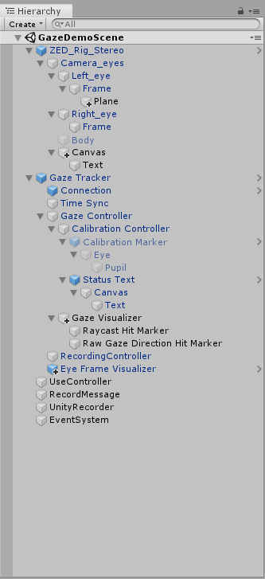

# 目次
- [VIVE with PupilLabs について](#VIVE-with-PupilLabs-について)
- [VIVE with PupilLabs のオブジェクト](#VIVE-with-PupilLabs-のオブジェクト)    
	- [追加したゲームオブジェクトとその追加方法 および 追加した目的](#追加したゲームオブジェクトとその追加方法-および-追加した目的)  
	- [変更したC#のスクリプト](#変更したCのスクリプト)  
	- [追加したC#のスクリプト および 追加した目的](#追加したCのスクリプト-および-追加した目的)  
	- [オブジェクトに追加したスクリプト](#オブジェクトに追加したスクリプト)  
	- [Inspectorでの設定](#Inspectorでの設定)  
	- [ゲームオブジェクトの座標](#ゲームオブジェクトの座標)  
		- [画面に文字を表示するためのオブジェクト](#画面に文字を表示するためのオブジェクト)  
	- [ProjectSettings](#ProjectSettings)  
 
 
 

## VIVE with PupilLabs について
＝＝＝＝＝＝＝＝＝＝＝＝＝＝＝＝＝＝＝＝＝＝＝＝＝＝＝＝＝＝＝＝＝ 
VIVE Pro と ZEDmini と PupilLabsを使用． 
パススルーしながらPupilLabsを利用し，
リアルタイムでどこに視点を置いているかを黄色の丸で表示するプロジェクト 
 
実行する際にはPupilCaptureを起動しておく必要があります． 
 
主な仕様は以下の通りです． 
- キーボードのCを押すことでキャリブレーション  
- コントローラのボタンで録画開始と録画停止が可能（PupilCaptureも同期）
録画に失敗した場合はその旨を画面に表示
 
(必要があれば適宜追記) 
＝＝＝＝＝＝＝＝＝＝＝＝＝＝＝＝＝＝＝＝＝＝＝＝＝＝＝＝＝＝＝＝＝ 
 

### 必要な準備

＝＝＝＝＝＝＝＝＝＝＝＝＝＝＝＝＝＝＝＝＝＝＝＝＝＝＝＝＝＝＝＝＝ 
まずは環境構築から． 
[こちら](https://github.com/atsushi-wada/fpp-recording/tree/master/preparation/1.environment)を参考に，パススルーできるところまで進めてください． 
次に[こちら](https://github.com/atsushi-wada/fpp-recording/tree/master/preparation/2.PupilLabs)
を参考にPupilLabsをUnity上で使えるようにしてください． 
＝＝＝＝＝＝＝＝＝＝＝＝＝＝＝＝＝＝＝＝＝＝＝＝＝＝＝＝＝＝＝＝＝ 
 
 
 
 ## VIVE with PupilLabs のオブジェクト
＝＝＝＝＝＝＝＝＝＝＝＝＝＝＝＝＝＝＝＝＝＝＝＝＝＝＝＝＝＝＝＝＝ 
まずゲームオブジェクトは何があるのかを紹介します． 
以下の画像に載っている通りです． 
  
すべてが元から用意されたものではないので， 
次にどれが追加したものかを載せておきます． 
＝＝＝＝＝＝＝＝＝＝＝＝＝＝＝＝＝＝＝＝＝＝＝＝＝＝＝＝＝＝＝＝＝ 
 
 
### 追加したゲームオブジェクトとその追加方法 および 追加した目的
＝＝＝＝＝＝＝＝＝＝＝＝＝＝＝＝＝＝＝＝＝＝＝＝＝＝＝＝＝＝＝＝＝ 
オブジェクトはヒエラルキー部分の右クリックで追加可能です． 
またオブジェクトの親子関係は分かるように書いたつもりですが， 
分かりにくかったら上で表示してる画像で確認してください． 
＝＝＝＝＝＝＝＝＝＝＝＝＝＝＝＝＝＝＝＝＝＝＝＝＝＝＝＝＝＝＝＝＝ 

	・ZED_Rig_StereoのCamera_eyesの下の 
	    ・Camera_eyes下の  
      		・Left_eye下の  
      			・Frame下の  
      				・Plane	：3DオブジェクトのPlaneで追加__視点を投影するための壁  
      		・Canvasの下の
      			・Text		：UIのTextで追加__録画の開始と停止、失敗を画面に表示するため
	・Gaze Trackerの下の
      		・RecordingController	：CreatEmptyで追加__PupilLabs側に録画の命令を送信するため	
	・UseController		：CreatEmptyで追加__csvファイルへの出力に関するスクリプトを使うため  
	・RecordMessage		：CreatEmptyで追加__録画の開始と停止、失敗を画面に表示するため 
＝＝＝＝＝＝＝＝＝＝＝＝＝＝＝＝＝＝＝＝＝＝＝＝＝＝＝＝＝＝＝＝＝ 
 
 
### 変更したC#のスクリプト
＝＝＝＝＝＝＝＝＝＝＝＝＝＝＝＝＝＝＝＝＝＝＝＝＝＝＝＝＝＝＝＝＝ 

	・ZEDManager.cs
	・ZEDCameraEditor.cs
	・TimeSync.cs
	・RecordingController.cs
＝＝＝＝＝＝＝＝＝＝＝＝＝＝＝＝＝＝＝＝＝＝＝＝＝＝＝＝＝＝＝＝＝ 
これらはのスクリプトは[ここ](https://github.com/atsushi-wada/fpp-recording/tree/master/project/VIVE%20with%20PupilLabs/%E5%A4%89%E6%9B%B4%E3%81%97%E3%81%9F%E3%82%B9%E3%82%AF%E3%83%AA%E3%83%97%E3%83%88)に用意しています．
 
＝＝＝＝＝＝＝＝＝＝＝＝＝＝＝＝＝＝＝＝＝＝＝＝＝＝＝＝＝＝＝＝＝ 
 
 
### 追加したC#のスクリプト および 追加した目的
＝＝＝＝＝＝＝＝＝＝＝＝＝＝＝＝＝＝＝＝＝＝＝＝＝＝＝＝＝＝＝＝＝ 

	・Void_NotVisualizingLayer.cs：Planeを画面上に表示しないため
	・UseController.cs： HMD付属のコントローラのボタンで録画開始と録画停止を行うため
	・RecordMessage.cs： 録画開始，録画停止，録画失敗を画面に表示するため
＝＝＝＝＝＝＝＝＝＝＝＝＝＝＝＝＝＝＝＝＝＝＝＝＝＝＝＝＝＝＝＝＝ 
これらのスクリプトは[ここ](https://github.com/atsushi-wada/fpp-recording/tree/master/project/VIVE%20with%20PupilLabs/%E8%BF%BD%E5%8A%A0%E3%81%97%E3%81%9F%E3%82%B9%E3%82%AF%E3%83%AA%E3%83%97%E3%83%88)に用意しています．
 
＝＝＝＝＝＝＝＝＝＝＝＝＝＝＝＝＝＝＝＝＝＝＝＝＝＝＝＝＝＝＝＝＝ 
 
 
### オブジェクトに追加したスクリプト
＝＝＝＝＝＝＝＝＝＝＝＝＝＝＝＝＝＝＝＝＝＝＝＝＝＝＝＝＝＝＝＝＝ 
ゲームオブジェクトを追加しただけでは何も動作しません． 
C#のスクリプトにて，させたい動作を書く必要があります． 
また，書いたスクリプトをゲームオブジェクトに追加する必要があります． 
追加方法は 
・オブジェクトを選択し，右側に表示されるInspectorのAddComponentで検索して追加  
・Unityの下のProjectタブから追加したいスクリプトをドラッグして，追加したいオブジェクトのところにドロップ  
のどちらかです． 
置いてる場所が分からなかい場合は前者でいいと思います． 
＝＝＝＝＝＝＝＝＝＝＝＝＝＝＝＝＝＝＝＝＝＝＝＝＝＝＝＝＝＝＝＝＝ 

	・ZED_Rig_StereoのCamera_eyesの下の 
	    ・Camera_eyes下の  
      		・Left_eye：Void_NotVisualizingLayer.csを追加
	・UseController		：UseController.csを追加
	・RecordMessage		：RecordMessage.csを追加
	・RecordingController	：RecordingController.csを追加
＝＝＝＝＝＝＝＝＝＝＝＝＝＝＝＝＝＝＝＝＝＝＝＝＝＝＝＝＝＝＝＝＝ 
 
 
### Inspectorでの設定
＝＝＝＝＝＝＝＝＝＝＝＝＝＝＝＝＝＝＝＝＝＝＝＝＝＝＝＝＝＝＝＝＝ 
ゲームオブジェクトにスクリプトを追加するだけではうまく動作しないものもあります．   
Inspectorで設定する前提で書いたスクリプトなどがあるとそうなります． 
このプロジェクトでInspectorで設定するものを書いておきます． 
（オブジェクトの指定などはドラッグ&ドロップするか，リストから指定する） 
＝＝＝＝＝＝＝＝＝＝＝＝＝＝＝＝＝＝＝＝＝＝＝＝＝＝＝＝＝＝＝＝＝ 

	・ZED_Ri_Stereo下の
		・Camera_eyesの下の
			・Left_eyeの下の
				・Plane：Layerを適当なものを追加して設定(Void_NotVisualizingLayer.csで参照するために使用する．用意したスクリプトではNotVisualizingとして書いている)
	・GazeTracker下の
		・Time Sync：Tagを適当なtagを作成して設定（tagはZEDmanager.csから参照するのに使用する．用意したスクリプトではTsyncとしている）
		・RecordingController：
			Tagを適当なtagを作成して設定（tagはZEDmanager.csから参照するのに使用する．用意したスクリプトではsyncとしている）
			Request Ctrl を Connection に設定
	・UseControllerのUseController：
		Manager には オブジェクトの ZED_Rig_Stereo を指定 
		Record Mesage には オブジェクトの RecordMessage を指定
		Calibration には オブジェクトの Calibration Controller を指定
	・RecordMessageのRecordMessage：
		Text_object には オブジェクトの Text を指定
		Manager には オブジェクトの ZED_Rig_Stereo を指定 
＝＝＝＝＝＝＝＝＝＝＝＝＝＝＝＝＝＝＝＝＝＝＝＝＝＝＝＝＝＝＝＝＝ 
 
 
### ゲームオブジェクトの座標 
＝＝＝＝＝＝＝＝＝＝＝＝＝＝＝＝＝＝＝＝＝＝＝＝＝＝＝＝＝＝＝＝＝ 
検証後，追記 
＝＝＝＝＝＝＝＝＝＝＝＝＝＝＝＝＝＝＝＝＝＝＝＝＝＝＝＝＝＝＝＝＝ 
 
 
 ### ProjectSettings
 ＝＝＝＝＝＝＝＝＝＝＝＝＝＝＝＝＝＝＝＝＝＝＝＝＝＝＝＝＝＝＝＝＝ 
 Unity上で設定することとして書き忘れがあったため追記． 
 Edit->ProjectSettings から設定する必要のある項目を記載しておきます． 
 - Input にて
	- Fire3をRecordButttonにRenameし，PositiveButtonをjoystick button 9に設定 

＝＝＝＝＝＝＝＝＝＝＝＝＝＝＝＝＝＝＝＝＝＝＝＝＝＝＝＝＝＝＝＝＝ 
 
 
